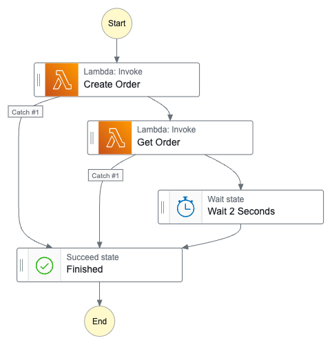

## 📖 Sobre

Boilerplate de Step Functions para integração com AWS Lambda.

### Principais Funcionalidades

- 👥 **Criação de Pedidos**
  - Criação de novos pedidos
  - Validação de dados
  - Persistência no DynamoDB


## 🏗 Arquitetura

O projeto segue uma arquitetura modular e enxuta, com as seguintes pastas principais:

```
src/
├── modules/
│   └── orders/
│       ├── core/
│       │   ├── model/
│       │   │   └── order.model.ts
│       │   └── use-cases/
│       │       ├── add-order.use-case.ts
│       │       └── get-order-by-id.use-case.ts
│       ├── http/
│       │   └── handlers/
│       │       ├── add-order.ts
│       │       ├── get-order-by-id.ts
│       │       ├── dtos/
│       │       │   └── create-order.dto.ts
│       │       └── validation/
│       │           └── order.validation.ts
│       └── persistence/
│           └── repository/
│               └── order.repository.ts
├── shared/
│   ├── core/
│   │   ├── exception/
│   │   │   ├── domain.exception.ts
│   │   │   └── not-found-domain.exception.ts
│   │   └── model/
│   │       └── default.model.ts
│   └── modules/
│       ├── logging/
│       │   └── winston/
│       │       └── logger.ts
│       └── persistence/
│           └── dynamo.repository.ts
```

- **modules/orders**: Domínio de pedidos, com handlers, use-cases, models e repositórios.
- **shared/core**: Exceções e modelos base compartilhados.
- **shared/modules**: Utilitários compartilhados como logging e persistência.

## 🚀 Tecnologias

- **Backend**
  - [Node.js](https://nodejs.org/) v22.12.0
  - [TypeScript](https://www.typescriptlang.org/)

- **Infraestrutura**
  - [DynamoDB](https://aws.amazon.com/dynamodb/)
  - [Serverless Framework](https://www.serverless.com/)
  - [AWS Lambda](https://aws.amazon.com/lambda/)
  - [Step Functions](https://aws.amazon.com/step-functions/)

- **Qualidade**
  - [ESLint](https://eslint.org/)
  - [Prettier](https://prettier.io/)
  - [Husky](https://typicode.github.io/husky/)

## 🛠 Setup do Ambiente

### Pré-requisitos

- Node.js v22.12.0 (via nvm)
- PNPM
- PostgreSQL
- AWS CLI configurado

### Instalação

1. **Configure o Node.js com NVM**
   ```bash
   nvm install v22.12.0
   nvm use v22.12.0
   ```

3. **Instale as dependências**
   ```bash
   npm install -g pnpm
   pnpm install
   ```

4. **Configure o ambiente**
   ```bash
   cp .env.example .env
   # Edite o arquivo .env com suas configurações
   ```

### Scripts Disponíveis

- 🚀 **Deploy**
  ```bash
  pnpm deploy:pet        # Deploy ambiente de desenvolvimento
  pnpm deploy:pet        # Deploy ambiente de teste
  pnpm deploy:prd        # Deploy produção
  ```

- 🧹 **Qualidade**
  ```bash
  pnpm lint              # Verifica código
  pnpm format            # Formata código
  ```

## 🔄 Fluxo de Orquestração (Step Functions)

O projeto utiliza AWS Step Functions para orquestrar processos entre Lambdas. Exemplo de fluxo:

<div align="center">
  
</div>

**Descrição do fluxo:**
- Criação de pedido (Create Order)
- Consulta do pedido (Get Order)
- Espera de 2 segundos (Wait)
- Finalização (Finished)
- Tratamento de erros com Catch


## 🐞 Debugando Funções Lambda Localmente

Você pode debugar handlers Lambda localmente usando o VSCode e o `ts-node`:

1. **Configuração do VSCode**
   - O arquivo `.vscode/launch.json` já está pronto para debug com TypeScript:

```json
{
  "type": "node",
  "request": "launch",
  "name": "Debug Handler (ts-node)",
  "program": "${workspaceFolder}/.vscode/invoke.js",
  "runtimeArgs": ["-r", "ts-node/register"],
  "console": "integratedTerminal",
  "envFile": "${workspaceFolder}/.env"
}
```

2. **Arquivo de entrada para debug**
   - Edite `.vscode/invoke.js` para apontar para o handler desejado e simular o evento:

```js
require("dotenv").config();
const { handler } = require("../src/modules/orders/http/handlers/add-order");
const mockEvent = { body: { name: "Order 1", description: "Order 1 description" } };
handler(mockEvent)
  .then((result) => console.log("Resultado:", result))
  .catch((error) => console.error("Erro:", error));
```

3. **Coloque breakpoints**
   - Abra o handler desejado e adicione breakpoints no VSCode.

4. **Inicie o debug**
   - No VSCode, selecione "Debug Handler (ts-node)" e pressione F5.

---

## 🧪 Testando e Invocando Funções

- **Invocar AddOrder localmente:**
  ```bash
  npx serverless invoke local --function AddOrder --stage dev --data '{ "name": "Order 1", "description": "Order 1 description" }'
  ```

- **Invocar GetOrderById localmente:**
  ```bash
  npx serverless invoke local --function GetOrderById --stage dev --data '{ "id": "SEU_ID_DE_PEDIDO" }'
  ```

- **Invocar função em ambiente AWS:**
  ```bash
  npx serverless invoke --function AddOrder --stage dev --region us-east-1 --log
  ```

- **Ver logs da função:**
  ```bash
  npx serverless logs -f AddOrder -s dev -r us-east-1 -t
  ```

> Consulte o arquivo `serverless.yml` para os nomes exatos das funções.

Mais exemplos e detalhes na [documentação oficial do Serverless](https://www.serverless.com/framework/docs/providers/aws/cli-reference/).

---
